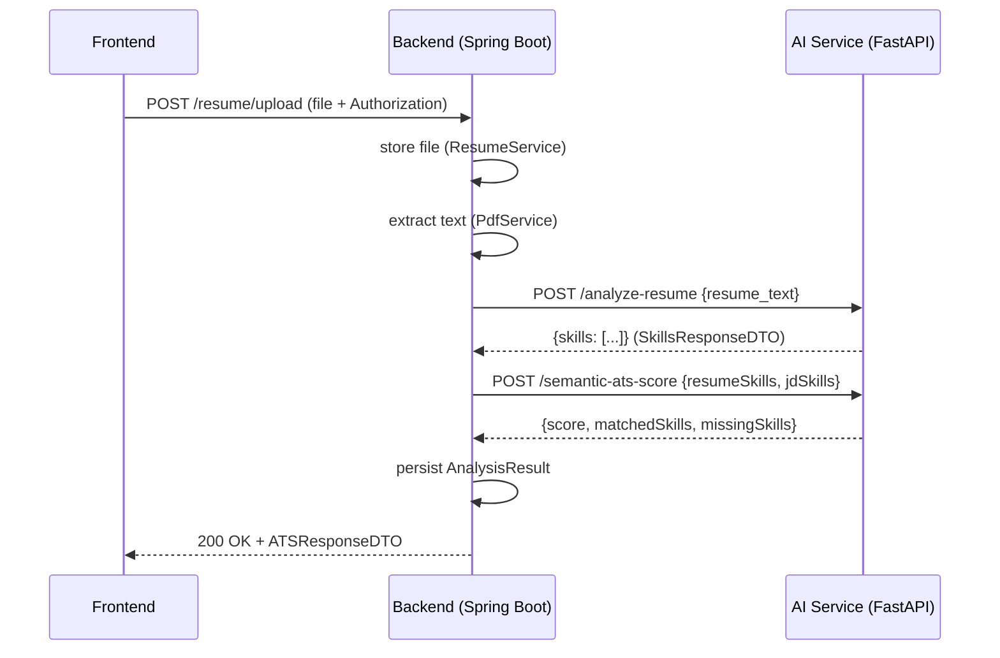

# ResumeFit Backend — File-by-File Guide

This document explains why each important file exists, what it does, how it works, and how it fits into request flows.

---

## Table of Contents
- [Overview](#overview)
- [Build & Run](#build--run)
- [Configuration](#configuration)
- [Project Layout & Package Responsibilities](#project-layout--package-responsibilities)
- [File-by-file Walkthrough](#file-by-file-walkthrough)
  - `ResumefitApplication.java`
  - `application.properties`
  - Controllers: `AuthController`, `ResumeController`, `AnalysisController`
  - Services: `AIService`, `ResumeService`, `ResumeAnalysisService`, `PdfService`, `AuthService`
  - DTOs
  - Entities & Repositories
  - Security: `JwtUtil`
- [Typical End-to-End Flow (Analyze Resume)](#typical-end-to-end-flow-analyze-resume)
- [Troubleshooting & Failure Modes](#troubleshooting--failure-modes)
- [Immediate Improvements & Recommendations](#immediate-improvements--recommendations)
- [Quick Links to Files](#quick-links-to-files)

---

## Overview
The backend is a Spring Boot application that handles:
- Authentication (signup/login + JWT)
- Resume uploads (store file metadata + file bytes)
- Orchestration with the AI microservice (FastAPI) for skill extraction and scoring
- Persisting and serving analysis history

Entry point: `ResumefitApplication` boots the Spring context and starts the web server.

---

## Build & Run
- Build and package:

```bash
cd resumefit-backend
mvnw.cmd clean package
```

- Run (development):

```bash
mvnw.cmd spring-boot:run
```

- Run packaged jar:

```bash
java -jar target/*.jar
```

---

## Configuration
Main config: `src/main/resources/application.properties` — contains DB connection and JPA settings. Key values:
- `spring.datasource.url` — Postgres JDBC URL
- `spring.datasource.username` / `spring.datasource.password` — DB credentials
- `spring.jpa.hibernate.ddl-auto` — currently `update` (development)

Recommendation: move secrets (DB password, JWT signing key) to environment variables or use Spring profiles.

---

## Project Layout & Package Responsibilities
- `contoller` — REST controllers (HTTP API surface)
- `service` — business logic and external clients (AI client, file handling)
- `dto` — request/response shapes (JSON ↔ Java mapping)
- `entity` — JPA entities persisted to DB
- `repository` — Spring Data repository interfaces
- `security` — JWT utilities and security-related helpers

---

## File-by-file Walkthrough

### `ResumefitApplication.java`
- Purpose: Spring Boot application entry point.
- Why it exists: starts the embedded servlet container and Spring context.
- How it works: `SpringApplication.run(...)` loads beans defined by `@SpringBootApplication` and component-scans packages.
- Where to look/modify: rarely changed. Add listeners or customizations here if needed.

### `application.properties`
- Purpose: application configuration.
- How it works: Spring Boot loads this file and exposes properties to beans via `@Value` or `@ConfigurationProperties`.
- Actionable changes: add `ai.service.base-url` and replace hardcoded AI URLs; move secrets to environment variables.

### Controllers

`AuthController.java`
- Purpose: `POST /auth/signup`, `POST /auth/login`, `GET /auth/me`.
- How it works: accepts DTOs, delegates to `AuthService`, returns DTOs/JWT.
- Flow: client -> controller -> `AuthService` -> `UserRepository` persists or queries users -> controller returns response.

`ResumeController.java`
- Purpose: `POST /resume/upload` for multipart resume uploads.
- How it works:
  - Accepts `MultipartFile` and optional `userId` param.
  - If `Authorization: Bearer <token>` provided, uses `JwtUtil` to extract email and sets `effectiveUserId`.
  - Validates presence of file and `effectiveUserId` and calls `ResumeService.uploadResume(...)`.
- Key edge cases: file missing, user cannot be inferred, file empty.

`AnalysisController.java`
- Purpose: `POST /api/analyze` to run analysis and persist results; `GET /api/history` and paged history.
- How it works: maps input JSON to `ATSAnalyzeRequestDTO`, delegates to `ResumeAnalysisService.analyzeAndStore()`, returns `ATSResponseDTO`.

### Services

`AIService.java`
- Purpose: client for AI microservice (FastAPI).
- What it calls:
  - `POST http://localhost:8000/analyze-resume` with `{ "resume_text": "..." }` → returns `SkillsResponseDTO`.
  - `POST http://localhost:8000/analyze-jd` with `{ "job_description": "..." }`.
  - `POST http://localhost:8000/ats-score` and `/semantic-ats-score` with `{ "resumeSkills": [...], "jdSkills": [...] }` → `ATSResponseDTO`.
- How it works: uses injected `RestTemplate.postForObject(url, request, ResponseClass.class)` and maps responses into DTOs.
- Why it exists: separates external API interaction from business logic; centralizes AI calls.
- Improvements: externalize base URL, configure timeouts, add retries/circuit-breaker.

`ResumeService.java`
- Purpose: store uploaded file to disk and persist `Resume` metadata.
- How it works: writes bytes to `uploads/` (or configured storage), creates `Resume` entity, saves via `ResumeRepository`.
- Where to extend: add cloud storage (S3), virus scanning, file type validation.

`ResumeAnalysisService.java`
- Purpose: orchestration for analysis flows: extract text, call AI, compute/store results.
- How it works:
  1. Uses `PdfService` to extract plain text from PDF/Doc.
  2. Calls `AIService.extractResumeSkills` (and `calculateATS`/`semanticATS` when required).
  3. Builds `AnalysisResult` entity with score, matched/missing skills and saves it.
- Why it exists: keep controller thin and encapsulate domain logic.

`PdfService.java`
- Purpose: extract textual content from PDFs and other formats.
- How it works: likely wraps a library (e.g., Apache PDFBox) to read text from bytes.
- Where to extend: OCR for images, DOCX parsing, handling different encodings.

`AuthService.java`
- Purpose: user registration, authentication, JWT creation.
- How it works: stores password hashes (BCrypt), validates credentials during login, issues JWT via `JwtUtil`.

### DTOs
- Purpose: typed mapping of JSON request/response bodies.
- Common DTOs:
  - `ResumeRequestDTO` — `{ "resume_text": "..." }` sent to AI.
  - `SkillsResponseDTO` — `{ "skills": [...] }` returned by AI.
  - `ATSRequestDTO` — `{ "resumeSkills": [...], "jdSkills": [...] }`.
  - `ATSResponseDTO` — `{ "score": n, "matchedSkills": [...], "missingSkills": [...] }`.
- How they work: Jackson maps JSON to POJOs automatically when used as `@RequestBody` or with `RestTemplate`.

### Entities & Repositories
- Entities: `User`, `Resume`, `AnalysisResult` — annotated JPA classes representing database tables.
  - `User`: id, email, passwordHash, name, roles.
  - `Resume`: id, userId, filename, path, uploadedAt.
  - `AnalysisResult`: id, userId, resumeId, score, matchedSkills, missingSkills, createdAt.
- Repositories: interfaces extending `JpaRepository` providing CRUD and query methods.
- Why they exist: persistence layer decoupled by Spring Data.

### Security — `JwtUtil` and Token Flow
- Purpose: create and validate JWTs and extract claims (email, subject).
- Flow: `AuthService.login()` generates token and returns to client; client sends token in `Authorization` header; controllers use `JwtUtil.extractEmail(token)` to identify user.
- Where to change: signing key configuration; token expiration.

---

## Typical End-to-End Flow (Analyze Resume)

1. Frontend uploads resume:
   - `POST /resume/upload` (multipart `file`) with `Authorization: Bearer <JWT>` or `userId` parameter.
2. `ResumeController` validates request and calls `ResumeService.uploadResume`.
3. File is saved to disk and `Resume` entity persisted.
4. `ResumeAnalysisService`/`PdfService` extracts text from the uploaded file.
5. `AIService.extractResumeSkills(resumeText)` posts to `POST /analyze-resume` on the AI microservice.
6. `AI` returns `SkillsResponseDTO` with `skills` list.
7. `ResumeAnalysisService` may call `AIService.calculateATS(...)` or `semanticATS(...)` to compute score vs JD.
8. `AnalysisResult` is created and persisted.
9. Controller returns `ATSResponseDTO` to frontend.

Mermaid sequence diagram (high-level):



---

## Troubleshooting & Failure Modes
- AI service unreachable: verify FastAPI is running at `localhost:8000`. Add network checks and timeouts to `RestTemplate` to avoid blocking threads.
- Mapping errors from AI responses: ensure DTO fields match AI JSON keys (case-sensitive with Jackson unless configured).
- DB connection errors: check `application.properties` credentials and that Postgres is up.
- JWT issues: ensure token format `Bearer <token>` and `JwtUtil` uses the same signing secret.

---

## Immediate Improvements & Recommendations
1. Externalize AI base URL `ai.service.base-url` in `application.properties` and inject into `AIService`.
2. Configure `RestTemplate` bean with connect/read timeouts and use `HttpComponentsClientHttpRequestFactory` for better control.
3. Add retry and circuit breaker (Resilience4j) around AI calls.
4. Replace `hibernate.ddl-auto=update` with migrations (Flyway/Liquibase).
5. Move secrets to environment variables or a secrets manager.
6. Add unit tests for `AIService` (mock `RestTemplate`) and integration tests with Testcontainers for Postgres.

---

## Quick Links to Files
- Entry: [src/main/java/com/resumefit/resumefit/ResumefitApplication.java](src/main/java/com/resumefit/resumefit/ResumefitApplication.java#L1)
- Config: [src/main/resources/application.properties](src/main/resources/application.properties#L1)
- Controllers: [src/main/java/com/resumefit/resumefit/contoller](src/main/java/com/resumefit/resumefit/contoller)
- Services: [src/main/java/com/resumefit/resumefit/service](src/main/java/com/resumefit/resumefit/service)
- DTOs: [src/main/java/com/resumefit/resumefit/dto](src/main/java/com/resumefit/resumefit/dto)
- Entities: [src/main/java/com/resumefit/resumefit/entity](src/main/java/com/resumefit/resumefit/entity)
- Repositories: [src/main/java/com/resumefit/resumefit/repository](src/main/java/com/resumefit/resumefit/repository)

---

If you'd like, I can now:
- Add `ai.service.base-url` to `application.properties` and refactor `AIService` to use it, or
- Create a `RestTemplate` bean with timeouts and simple retry, or
- Produce an annotated, line-by-line walkthrough for any single file (pick one).

Which would you like next?